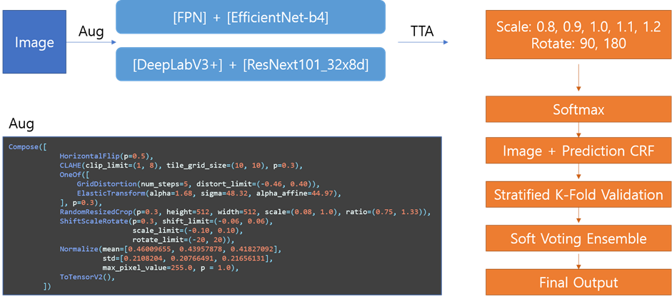

# Project: Recyclable Trash Segmentation & Detection
## [Click for Detail process in wrap-up report](https://www.notion.so/P-Stage3-Wrap-up-Report-8016915a2ba4406289c75a37a73296b9)

<br>

The problem of segmentation & detection by a given trash image with 12 classes
- `UNKNOWN`, `General trash`, `Paper`, `Paper pack`, `Metal`, `Glass`, `Plastic`, `Styrofoam`, `Plastic bag`, `Battery`, `Clothing`

<br>

**Model Structure**
> (1) Conduct model experiments in three directions dividing into 3 small teams: models that improve **Decoder**, utilize **Skip Connection** with variety, and extend **Receptive Fields**. Due to distribution of extremely large & small objects, third-direction model performed well.

> (2) To unify the experimental environment among team, share my own baseline code, give feedback each other. As sharing baseline code, responsible for leading the overall progress.

> (3) Achieve good performance through an ensemble of each high-performance models at the end.

> (4) For object detection, used mmdetection library. Understanding the principles of library together and adding custom structure in various ways.

<br>



<br>

## Task Description
We are living in an era where a lot of things are made and poured out, and therefore consumed in large quantities. But this culture is creating a serious garbage problem.

One way to reduce this environmental burden is **'separate collection'**. This is because well-separated waste is recycled in recognition of its value as a resource. However, there is a problem that it is difficult to know the exact method of recycling, such as 'where this garbage belongs' and 'what is right to separate and throw away'.

Therefore, we would like to solve this problem by creating a model to segment or detect waste from photos taken. The high-performance models you've created will be installed in the dump and used to help with proper recycling, or to educate young children about recycling. Raise your performance and save the Earth from the crisis! 🌎


<br>

## Getting Started

### Source Code Structure
 - `augmentation.py`: custom augmentation methods for training
 - `loss.py`: various loss functions for backward propagation (classification)
 - `optimizer.py`: various optimizers for updating parameters
 - `scheduler.py`: various schedulers for learning rate
 - `utils.py`: various functions for train & inference as Early stopping, Handle config etc...
 - `recycle_dataset.py`: pytorch dataset for both training & Inference
 - `recycle_model.py`: CNN models using various CNN backbone
 - `train.py`: training model with using various hyperparmeters
 - `inference.py`: make prediction by trained models

<br>

### Dataset Description
**images**
- `id`: Unique image id in file
- `height`: 512
- `width`: 512
- `file_name`: ex) batch_01_vt/002.jpg

**annotations** (coco annotation)
- `id`: Unique annotation id in file
- `segmentation`: Unique masked coordinates
- `bbox`: Coordinates of the box where the object exists (x_min, y_min, w, h)
- `area`: Size of the area where the object exists
- `category_id`: The id of the class in which the object corresponds (11 classes)
- `image_id`: Unique image id with an anotation

<br>

### Training Model with various hyperparameters
```json
{
    "environment_parameters": {
        "coco_train_json": "train.json",
        "coco_val_json": "val.json"
    },
    "hyper_parameters": {
        "learning_rate": 1e-4,
        "train_batch_size": 8,
        "valid_batch_size": 16,
        "nepochs": 30,
        "patience": 5,
        "seed": 42,
        "num_workers": 4
    },
    "network_env": {
        "model": "EfficientDet5AP",
        "optimizer": "AdamW",
        "optimizer_params": {
            "weight_decay": 1e-6
        },
        "scheduler": "StepLR",
        "scheduler_params": {
            "step_size": 5,
            "gamma": 0.95
        },
        "train_augmentation": "BaseTrainAugmentation",
        "val_augmentation": "BaseValAugmentation",
        "model_save_name": "EfficientDet5AP_ver1"
    }
}
```

### Make Predictions
```json
{
    "environment_parameters": {
        "coco_test_json": "test.json"
    },
    "test_parameters": {
        "batch_size": 32,
        "seed": 42,
        "num_workers": 4,
        "score_threshold": 0.05
    },
    "network_env": {
        "model": "EfficientDet5AP",
        "test_augmentation": "BaseTestAugmentation",
        "model_name": "EfficientDet5AP_ver1/EfficientDet5AP_ver1_19.pt"
    }
}

```
